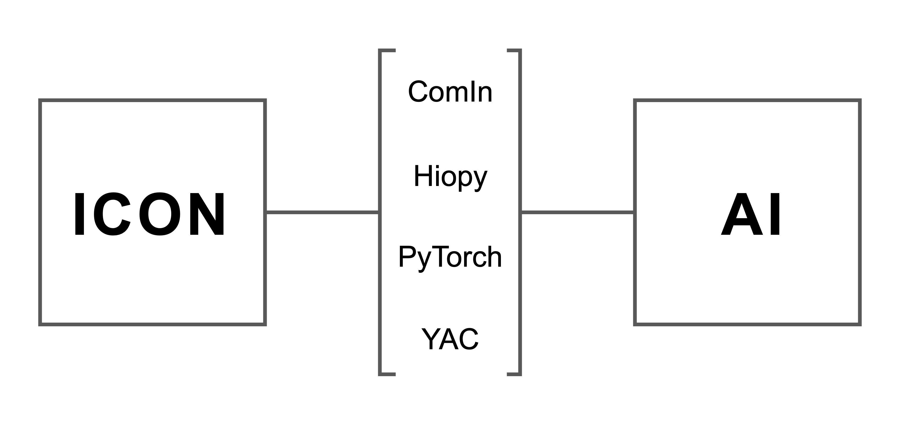
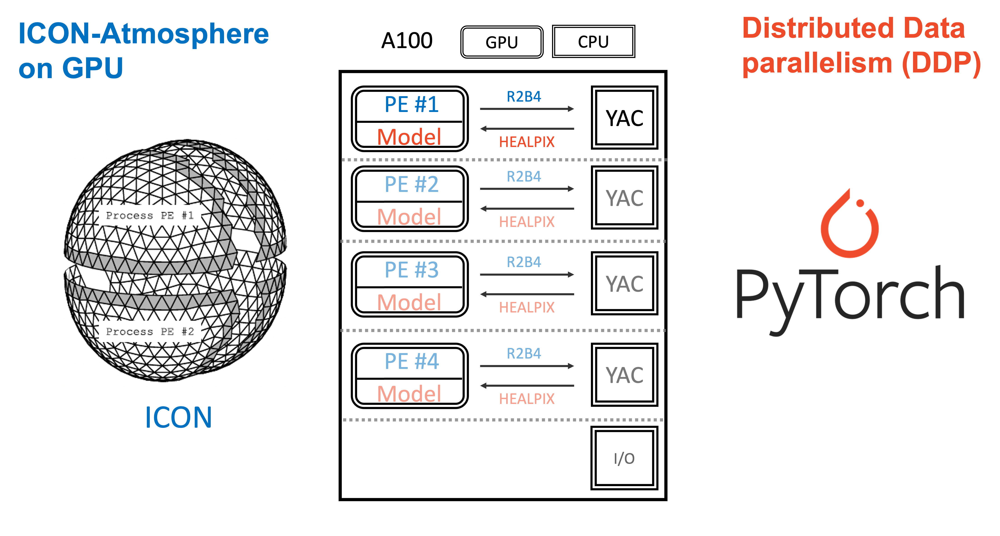
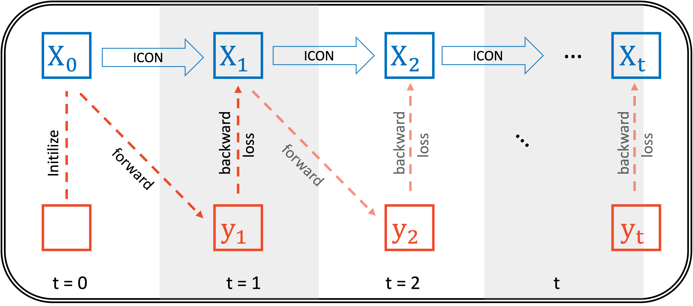
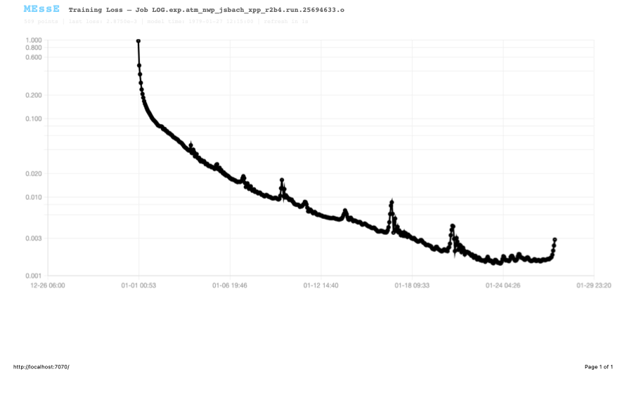
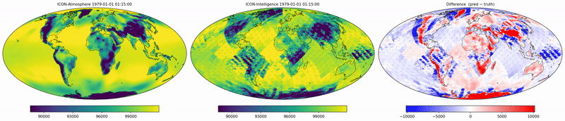

# MEssE: pretraining surrogate AI models online for km-scale ICON

## Introduction
### Motivation
High-frequency output for km-scale simulations is too big to be stored, but AI emulators precisely rely on these data for training. To address this dilemma, we introduce MEssE --- a framework that trains a surrogate AI model online during ICON simulations using in-memory data.

### Architecture
An online setup is possible for ICON, because it provides several interfaces that can be connected to the deeplearning framework, such as PyTorch and JAX. 

### A Demo
The GIF shows a demo of MEssE, where the left panel shows the global mean surface temperature from a ICON run, and the right panel shows the traning loss a very simple nearal network. The loss is decreasing while ICON is running, which proves that the online training is possible.

## GPU-based Parallalism
ICON-atmosphere runs on GPU, where the globe is divided into multiple domains, and each domain is assigned to a GPU. Therefore, DDP (Distributed Data Parallel) is used for training. For now, due to interpolation from ICON native grid to HEALPix grid using YAC, the data has to be transferred to the host memory.

## Rollout-based Training
With this online setup, at each timestep, only the data at the moment is available. To learn the very high-frequency temporal evolution, we design the following training strategy: 

## Current status

ICON-atmosphere R4B4, traning on the variable "pres_fsc" with UNet architecture, using DDP with 4 GPUs. 

**The training loss**:

**ICON output v.s. UNet prediction**:

