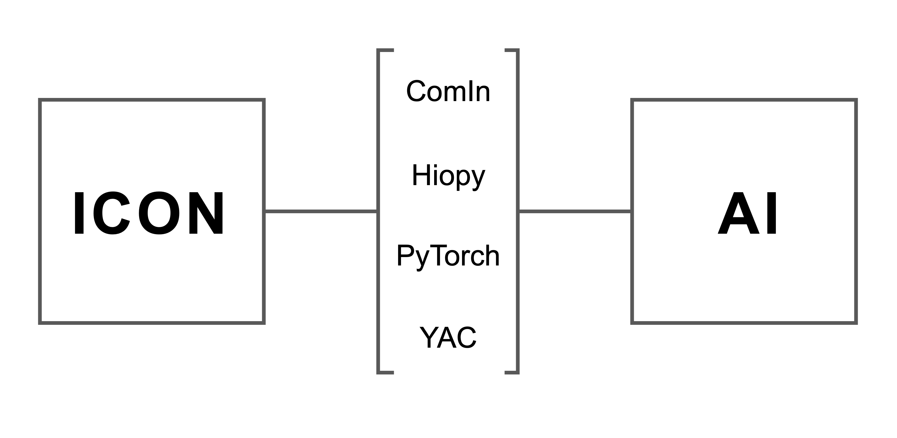
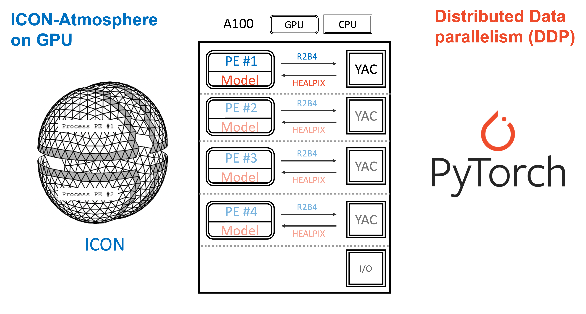
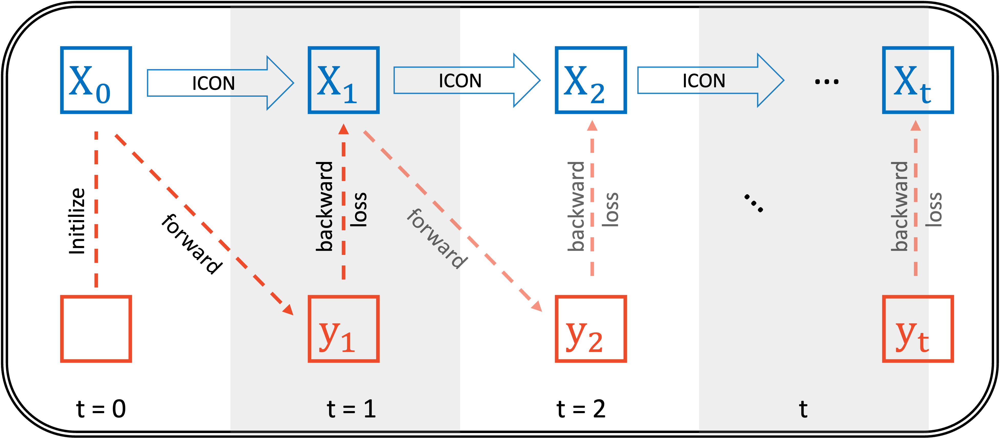
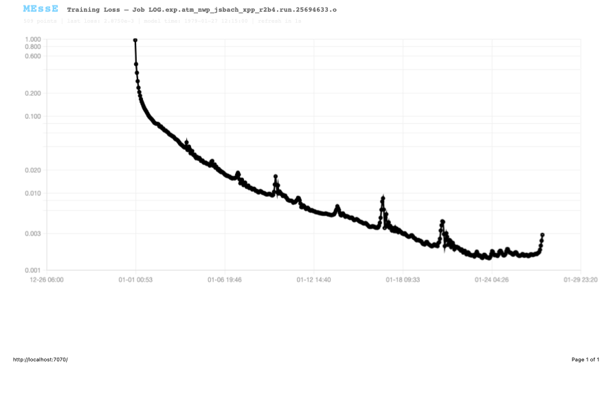
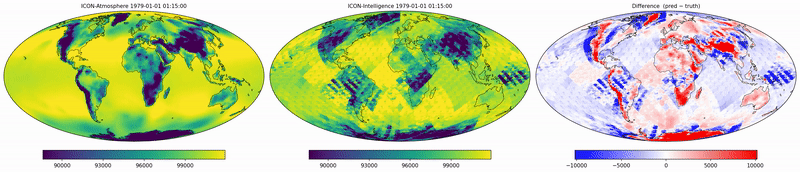

# MEssE: pretraining surrogate AI models online for km-scale ICON

## Introduction
### Motivation
High-frequency output for km-scale simulations is too big to be stored, but AI emulators precisely rely on these data for training. To address this dilemma, we introduce MEssE --- a framework that trains a surrogate AI model online during ICON simulations using in-memory data.

### Architecture
An online setup is possible for ICON, because it provides several interfaces that can be connected to the deeplearning framework, such as PyTorch and JAX. 

### A Demo
The GIF shows a demo of MEssE, where the left panel shows the global mean surface temperature from a ICON run, and the right panel shows the traning loss a very simple nearal network. The loss is decreasing while ICON is running, which proves that the online training is possible.

## GPU-based Parallalism
ICON-atmosphere runs on GPU, where the globe is divided into multiple domains, and each domain is assigned to a GPU. Therefore, DDP (Distributed Data Parallel) is used for training. For now, due to interpolation from ICON native grid to HEALPix grid using YAC, the data has to be transferred to the host memory.

## Rollout-based Training
With this online setup, at each timestep, only the data at the moment is available. To learn the very high-frequency temporal evolution, we design the following training strategy: 

## Current status

ICON-atmosphere R4B4, traning on the variable "pres_fsc" with UNet architecture, using DDP with 4 GPUs. 

**The training loss**:

**ICON output v.s. UNet prediction**:

## GNN on the ICON native grid (`gnn_plugin.py`)

`comin_plugin_torch/gnn_plugin.py` is an alternative to the UNet/HEALPix
plugin that trains a graph neural network **directly on the ICON native
(triangular) grid**, avoiding YAC and HEALPix interpolation entirely.

Design:
* **Patch = one rank's ICON domain-decomposed cells.** Each GPU already
  owns a contiguous region of the global mesh (its "owned" prognostic
  cells plus a halo ring shared by ICON's own MPI halo exchange). We treat
  that region as one training sample/graph, so the GPU layout and DDP
  world are inherited unmodified from ICON.
* **Graph construction** (`graph_utils.py`): nodes are all local cells
  returned by COMIN for a rank (owned + halo), edges come from ICON's
  native cell-to-cell adjacency (`domain.cells.neighbor_idx`/`neighbor_blk`),
  added in both directions with self-loops. Halo cells are kept as
  message-passing-only nodes (via `domain.cells.decomp_domain`) so
  boundary cells still receive correct neighbor information.
* **`nproma` vs. owned+halo cell count**: `glob.nproma` is only the block
  length used to flatten COMIN's `(idx, blk)` addressing into a single
  flat id (`graph_utils._flat_index`); it is *not* the number of local
  cells. The padded per-rank node array has size
  `n_nodes = domain.cells.nblks * nproma` (`LocalGraph.n_nodes`), which
  includes unused block padding. The actual owned+halo cell count is
  `domain.cells.ncells` (`LocalGraph.n_valid`), which is `<= n_nodes`.
* **Halo handling**: `utils.extract_icon_cells(data, domain.cells.ncells)`
  returns owned **and** halo cells (halos are *not* excluded) — this is
  needed so the GNN's message passing has correct input features for
  nodes near the patch boundary. Halo predictions are never written back
  to ICON: `gnn_plugin.py` masks the model output with
  `LocalGraph.owned_mask` (`domain.cells.decomp_domain == 0`) before
  calling `utils.insert_icon_cells(..., indices=owned_idx)`, and the
  training loss is likewise masked to owned cells only
  (`OnlineGNNTrainer._masked_mse`), so halo cells only ever pass messages
  and never contribute to the loss or the model's output.
